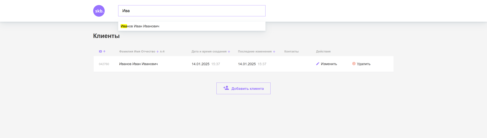
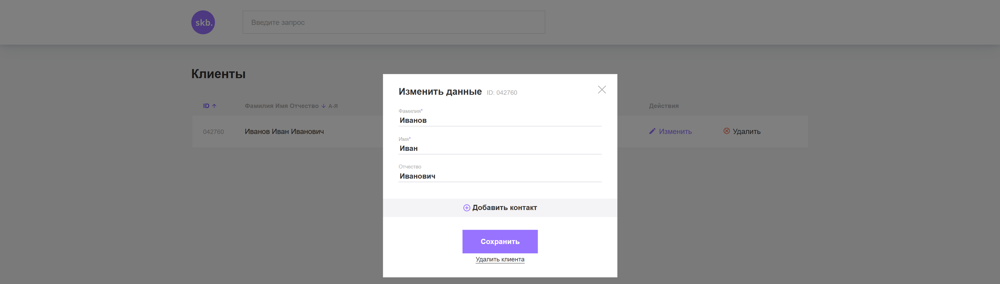
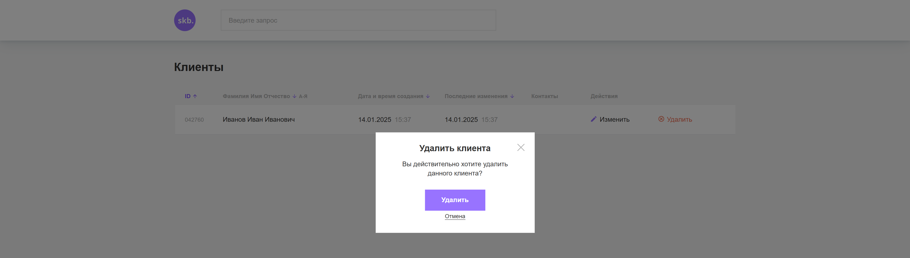

# **Приложение Clients на Javascript**

## **Описание проекта:**

Приложение представляет собой таблицу с контактной информацией о клиентах компании.

## **Ссылка на макет:**

[clients](https://www.figma.com/file/rcta5K2ySOhnskjG1D82jL/CRM)

## **Запуск проекта:**

backend: перейти в папку crm-backend и выполнить команду `node index`

## **В проекте реализован следующий функционал:**

- добавление нового клиента,
- изменение информации о существующем клиенте,
- удаление клиента,
- сортировка клиентов по заголовкам таблицы,
- поиск клиентов.

